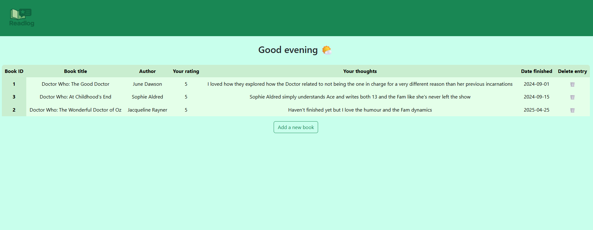
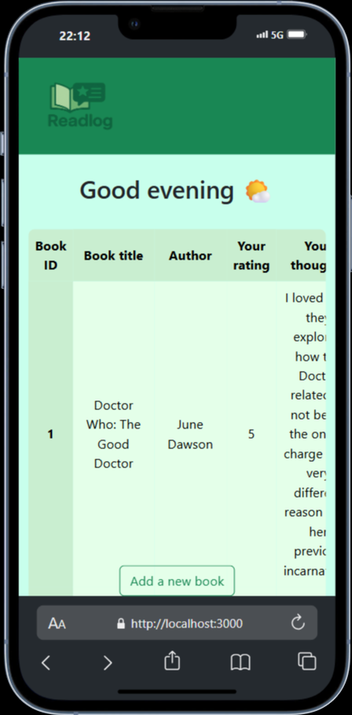

# Book Notes

A simple web application to keep track of books you’ve read, your thoughts, and ratings. Built with Node.js, Express, EJS, and Bootstrap.

---

## Features

- **Add new books** with title, author, notes, rating, and date finished.
- **Edit** any field of an existing book entry inline.
- **Delete** book entries.
- **Responsive design** for mobile and desktop.
- **Sortable table** for easy browsing of your book list.

---

## Screenshots




---

## Getting Started

### Prerequisites

- [Node.js](https://nodejs.org/) (v16 or later recommended)

- [npm](https://www.npmjs.com/)

### Installation

1. **Clone the repository:**

   ```sh
   git clone https://github.com/yourusername/book-notes.git
   cd book-notes
   ```

2. **Install dependencies:**

   ```sh
   npm install
   ```

3. **Start the server:**

   ```sh
   nodemon index.js
   ```

4. **Open your browser and visit:**
   ```
   http://localhost:3000
   ```

---

## Project Structure

```
Book Notes/
├── public/
│   ├── assets/
│   └── styles/
├── views/
│   ├── partials/
│   └── index.ejs
├── app.js
├── package.json
└── README.md
```

---

## Usage

- Click **"Add a new book"** to open the modal and enter book details.
- Edit or delete entries directly from the table.
- The app is mobile-friendly and works well on all screen sizes.

---

## Technologies Used

- **Node.js** & **Express** – Backend server
- **EJS** – Templating engine
- **Bootstrap 5** – Styling and responsive layout
- **Tablesort** – Client-side table sorting

---

## Customization

- Update styles in main.css.
- Modify views in the views folder.
- Extend backend logic in `app.js`.

---

## License

MIT License

---

## Credits

- [Bootstrap](https://getbootstrap.com/)
- [Tablesort](https://github.com/tristen/tablesort)
- [EJS](https://ejs.co/)

---

**Enjoy tracking your reading! 📚**
